# Fray Tracer
Computer Graphics Project #2-3 A Fundamental Ray Tracer

A ray-tracing	application	capable	of rendering fairly complex scenes.	Scenes	will be described	in	a	simple,	easy	to	parse	text	specification	file.

## FEATURES

- Camera	placement,	film	resolution,	aspect	ratio
- User	specified	background	colors
- BMP	or	PNG	output
- Spheres
- Triangles
- Ambient	lights
- Point	light	sources
- Directional lights
- Spot Light Sources
- Shadows
- Multiple	light	sources
- Basic	Sampling
- Color	&	Specularity	(Phong	Lighting	Model)
- Reflection
- Refraction
- Supersampling - Uniform, Random, Jittered

## SHOWCASE

### Spheres I - Uniform Supersampling (3)
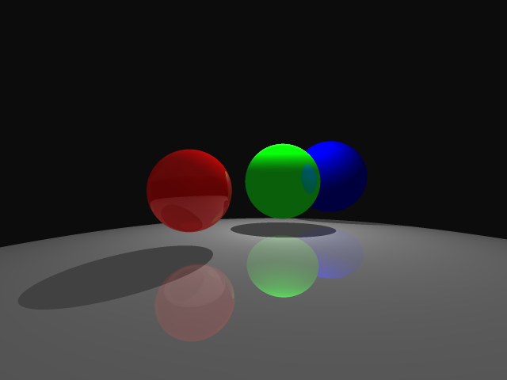

[Scene File](https://raw.github.com/debowin/fray-tracer/master/scenes/spheres1.scn)

---

### Spheres II - Random Supersampling (3)
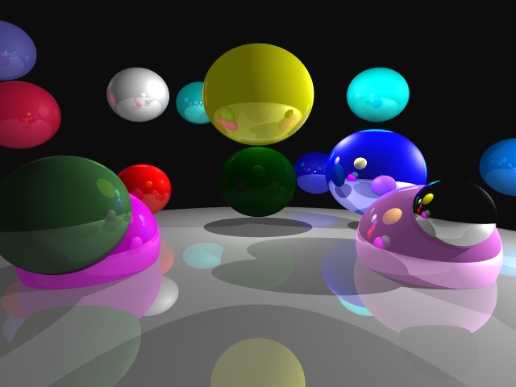

[Scene File](https://raw.github.com/debowin/fray-tracer/master/scenes/spheres2.scn)

---

### Teddy Bear - Jittered Supersampling (3)
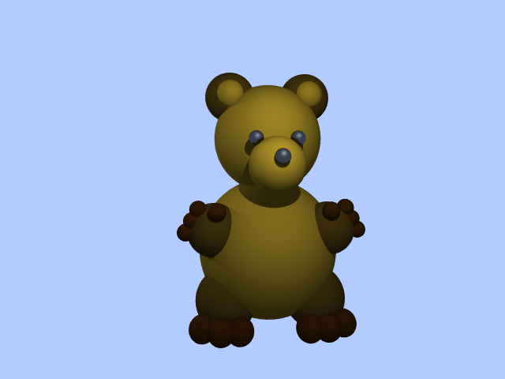

[Scene File](https://raw.github.com/debowin/fray-tracer/master/scenes/bear.scn)

---

### Spheres III - Jittered Supersampling (4)
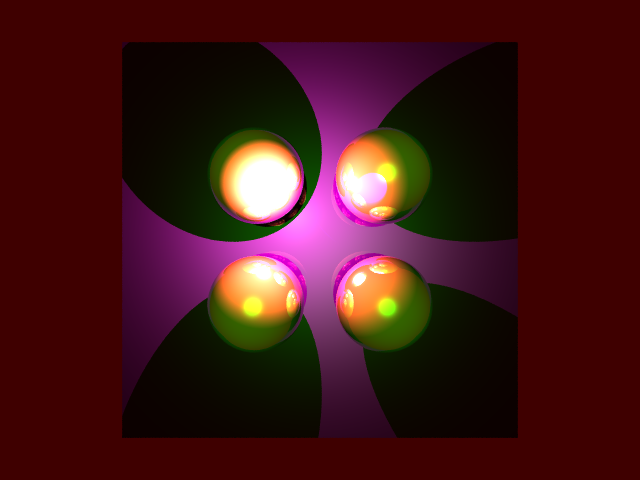

[Scene File](https://raw.github.com/debowin/fray-tracer/master/scenes/spheres3.scn)

---

### Spheres III X
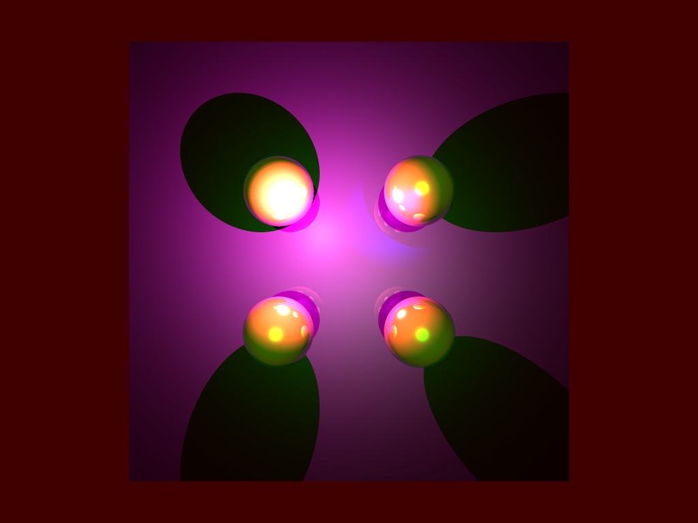

[Scene File](https://raw.github.com/debowin/fray-tracer/master/scenes/spheres3x.scn)

---

### Shadow Test
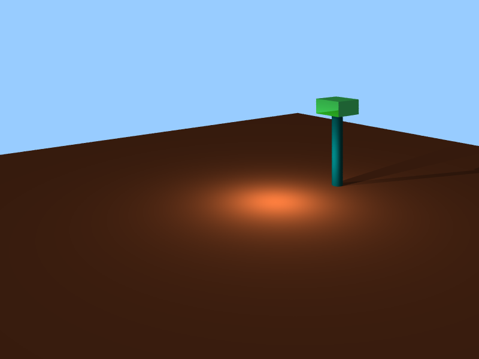

[Scene File](https://raw.github.com/debowin/fray-tracer/master/scenes/ShadowTest.txt)

---

### Bottle
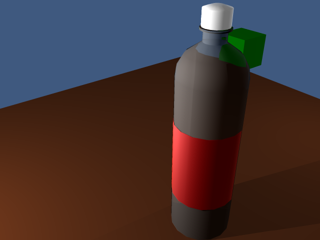

[Scene File](https://raw.github.com/debowin/fray-tracer/master/scenes/bottle.txt)

---

### Gear
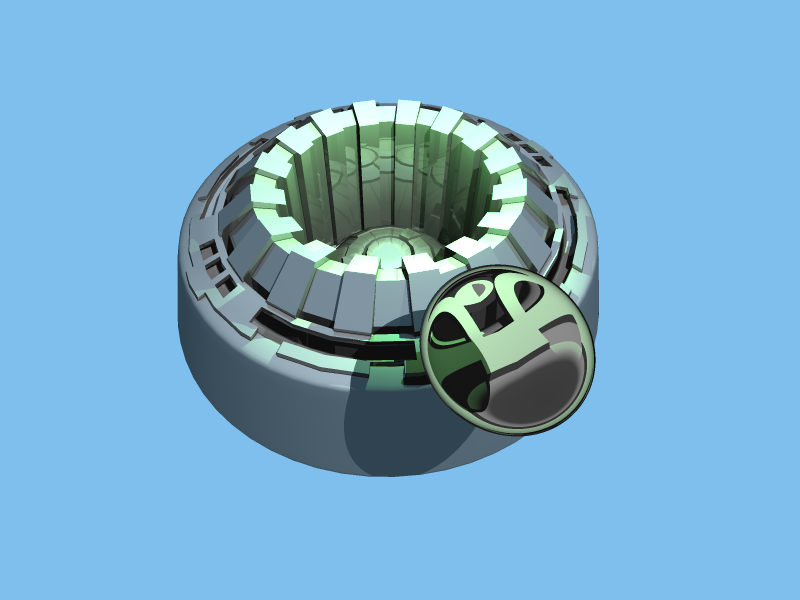

[Scene File](https://raw.github.com/debowin/fray-tracer/master/scenes/gear.txt)

---

### Arm Reach
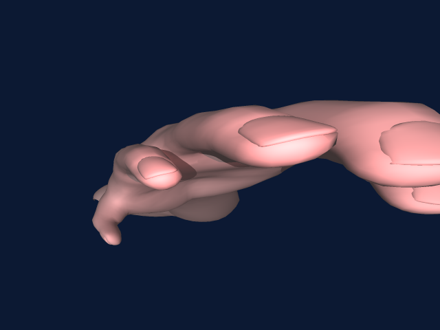

[Scene File](https://raw.github.com/debowin/fray-tracer/master/scenes/arm-reach.txt)

---

### Arm Top
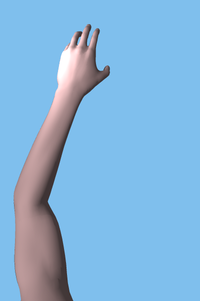

[Scene File](https://raw.github.com/debowin/fray-tracer/master/scenes/arm-top.txt)

---

### Dragon
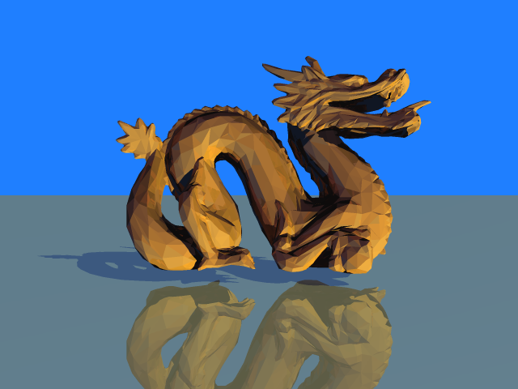

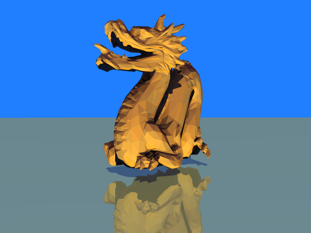

[Scene File](https://raw.github.com/debowin/fray-tracer/master/scenes/dragon.txt)