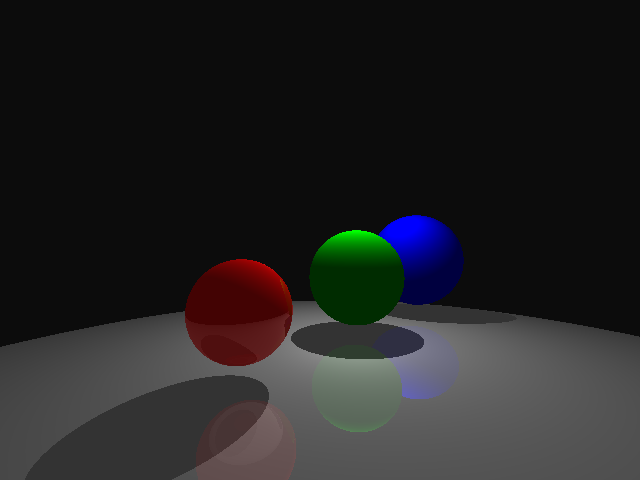

# Fray Tracer
Fundamentals of Computer Graphics Project #2 Basic Ray Tracer

### Features -

- (5)	Camera	placement,	film	resolution,	aspect	ratio
- (5)	User	specified	background	colors
- (5)	BMP	or	PNG	output
- (5)	Spheres
- (5)	Ambient	lights
- (5)	Point	light	sources
- (5)	Shadows
- (5)	Multiple	light	sources
- (5)	Basic	Sampling
- (5)	Color	&	Specularity	(Phong	Lighting	Model)
- (5)	Reflection

### Showcase -
|  Scene          |  Rendered          |
|:-------------------------|:-------------------------:|
|#Simple Sphere Scene camera -6 2 -4 .77 0 .64 0 1 0 35 output_image spheres1.bmp #"ground" sphere material .75 .75 .75 .75 .75 .75 .3 .3 .3 32 .2 .2 .2 1.5 sphere 0 -50 0 50  #red sphere material 1 0 0 1 0 0 .3 .3 .3 32 .2 .2 .2 1.5 sphere -3 1 0 .75  #green sphere material 0 .7 0 0 .7 0 0 0 0 16 .9 .9 .9 1.1 sphere 0 1.25 0 1  #blue sphere material 0 0 1 0 0 1 0 0 0 16 0 0 0 1.0 sphere 3 1.5 0 1.25  #white overhead light point_light 10 10 10 0 5 0 ambient_light .25 .25 .25 background .05 .05 .05  max_depth 5 |   |
|#Simple Sphere Scene camera 0 2 -10 0 -.1 .9 0 1 0 26 output_image spheres2.bmp  #"ground" sphere material .75 .75 .75 .75 .75 .75 .3 .3 .3 32 .2 .2 .2 1.5 sphere 0 -50 0 50  #red shpere material 1 0 0 1 0 0 .3 .3 .3 32 .2 .2 .2 1.5 sphere -3 1 0 .75  #green shpere material 0 .2 0 0 .2 0 .06 .06 .06 16 .8 .8 .8  1.1 sphere 0 1.25 0 1  #blue shpere material 0 0 1 0 0 1 1 1 1 16 0 0 0 1.0 sphere 3 1.5 0 1.25   material 0 .5 1 0 .5 1 .2 .2 .2 16 0 0 0 1 sphere 10 1.5 5 1.25  material .5 .5 1 .5 .5 1 .2 .2 .2 16 0 0 0 1 sphere -10 6.5 5 1.25  material 1 .1 .3 1 .1 .3 .2 .2 .2 16 0 0 0 1 sphere -8 3.5 3 1.25  material 0 1 1 0 1 1 .2 .2 .2 16 0 0 0 1 sphere 4 4.25 3 1  material .8 .8 .8 .8 .8 .8 .4 .4 .4 16 .1 .1 .1 1.1 sphere -4 4.25 3 1  material 1 1 0 1 1 0 .4 .4 .4 16 .1 .1 .1 1.1 sphere 0 3.2 -3 1 material 1 0 1 1 0 1 .4 .4 .4 16 .1 .1 .1 1.1 sphere -3 .2 -3 1.2  material 1 .5 1 1 .5 1 .6 .6 .6 16 .3 .3 .3 1.3 sphere 3 .2 -3 1.2  material 0 1 1 0 1 1 .6 .6 .6 16 .3 .3 .3 1.3 sphere -3 5 10 1.2  material 0 0 1 0 0 1 .6 .6 .6 16 .3 .3 .3 1.3 sphere 3 1 10 1.2  material 0 0 0 0 0 0 1 1 1 16 .3 .3 .3 1.3 sphere 3 1 -4 .6  material .1 .2 .1 .35 .7 .35 .3 .3 .3 16 .35 .7 .35 1 sphere -3 1 -4 1  #white overhad light point_light 10 10 10 0 5 0 point_light 50 50 50 10 5 -5 ambient_light .35 .35 .35 background .05 .05 .05  max_depth 2||
|#Sphere-based Teddy Bear  #Camera Set-up camera 1 3 7 -.1 -.1 -1 0 1 0 26 output_image bear.bmp   #Light Brown Body "Fur" Material material 0.44 0.37 0.10 0.44 0.37 0.10 0 0 0 2 0 0 0 1.0  #head sphere 0 3.27 -0.224 1  #body  sphere 0 1.241 -0.224 1.281   #snout sphere 0 2.814 0.967 0.461  #tail  sphere 0 0.503 -0.855 0.461  #ear hole sphere 0.717 4.061 0.017 0.274 sphere -0.717 4.061 0.017 0.274   #Dark Brown Limb "Fur" Material material 0.22 0.17 0.05 0.22 0.17 0.05 0 0 0 2 0 0 0 1.0  #legs sphere 0.788 0.441 0.232 0.542 sphere -0.788 0.441 0.232 0.542  #hands sphere 1.012 1.676 0.335 0.461 sphere -1.012 1.676 0.335 0.461  #ears sphere 0.711 4.039 -0.235 0.461 sphere -0.711 4.039 -0.235 0.461   #Dark Brown "Trim" Material material 0.17 0.09 0.015 0.17 0.09 0.015 0 0 0 2 0 0 0 1.0  #Left Fingers sphere 0.954 2.042 0.739 0.147 sphere 1.275 2.055 0.502 0.147 sphere 1.377 1.865 0.502 0.147 sphere 1.479 1.676 0.502 0.147  #Right Fingers sphere -0.954 2.042 0.739 0.147 sphere -1.275 2.055 0.502 0.147 sphere -1.377 1.865 0.502 0.147 sphere -1.479 1.676 0.502 0.147  #Left Toes sphere 1.194 0.102 0.608 0.229 sphere 0.888 0.102 0.758 0.229 sphere 0.581 0.102 0.758 0.229  #Right Toes sphere -1.194 0.102 0.608 0.229 sphere -0.888 0.102 0.758 0.229 sphere -0.581 0.102 0.758 0.229   #Black Plastic Material material 0.0 0.0 0.0 0.0 0.0 0.0 0.3 0.3 0.3 20 0 0 0 1.0  #eyes sphere 0.338 3.238 0.962 0.121 sphere -0.338 3.238 0.962 0.121  #nose sphere 0 2.952 1.468 0.121   #White overhead light point_light 20 20 20 0 5 5 point_light 50 50 50 10 5 -5 ambient_light .4 .4 .4 background .7 .8 1  max_depth 2||

### DOWNLOAD [Source Code Zip](http://github.com/debowin/fray-tracer/zipball/master/)