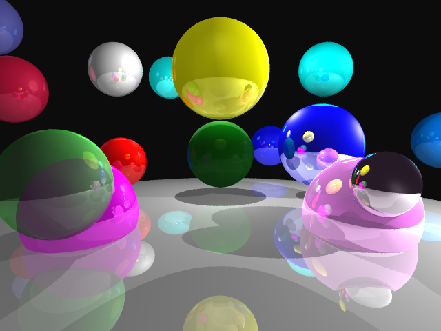

# Fray Tracer
Computer Graphics Project #2 A Fundamental Ray Tracer

A	simple	ray-tracing	application	capable	of rendering	scenes	consisting	of	spheres	lit	by	point	light	sources.	Scenes	will be described	in	a	simple,	easy	to	parse	text	specification	file.

### FEATURES

- Camera	placement,	film	resolution,	aspect	ratio
- User	specified	background	colors
- BMP	or	PNG	output
- Spheres
- Triangles
- Ambient	lights
- Point	light	sources
- Directional lights
- Spot Light Sources
- Shadows
- Multiple	light	sources
- Basic	Sampling
- Color	&	Specularity	(Phong	Lighting	Model)
- Reflection
- Supersampling - Regular, Random, Jittered

### SHOWCASE

|  Scene          |  Rendered          |
|:-------------------------|:-------------------------:|
| [spheres1.scn](https://raw.github.com/debowin/fray-tracer/master/scenes/spheres1.scn) |   |
| [spheres2.scn](https://raw.github.com/debowin/fray-tracer/master/scenes/spheres2.scn) | |
| [bear.scn](https://raw.github.com/debowin/fray-tracer/master/scenes/bear.scn) | |
| [spheres3.scn](https://raw.github.com/debowin/fray-tracer/master/scenes/spheres3.scn) | |
