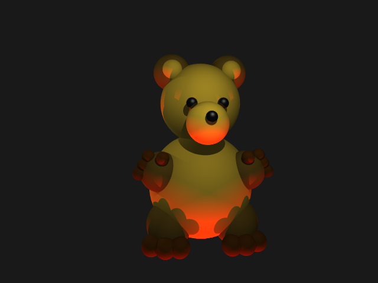
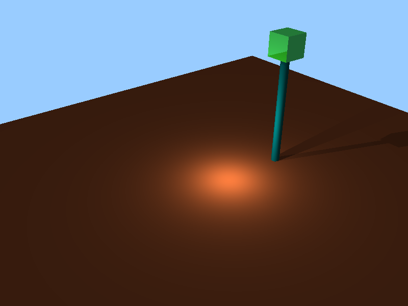
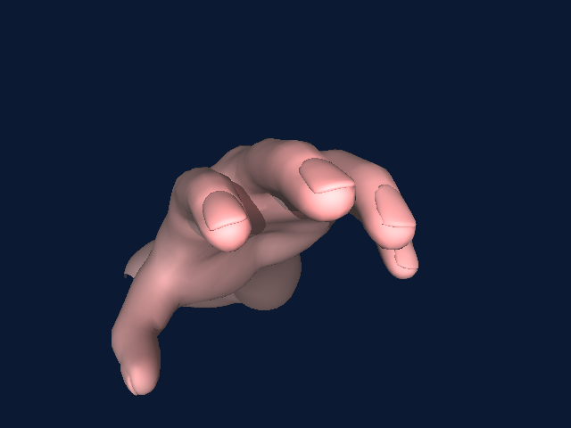
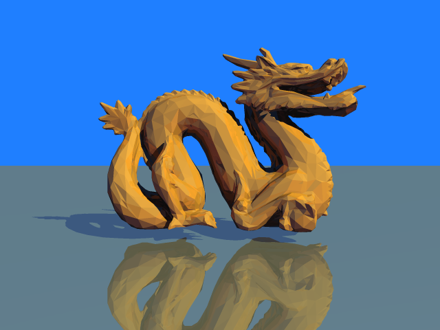
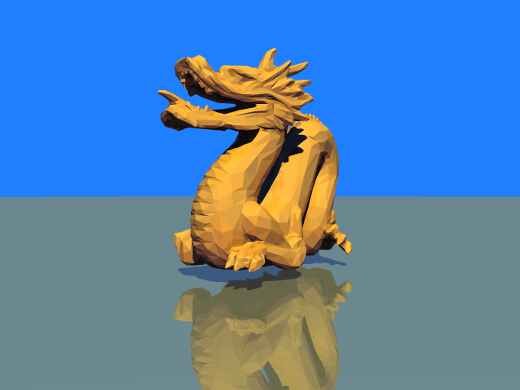

# Fray Tracer
Computer Graphics Project #2-3 A Fundamental Ray Tracer

A ray-tracing	application	capable	of rendering fairly complex scenes.	Scenes	will be described	in	a	simple,	easy	to	parse	text	specification	file.

## FEATURES

- Camera	placement,	film	resolution,	aspect	ratio
- User	specified	background	colors
- BMP	or	PNG	output
- Spheres
- Triangles
- Ambient	lights
- Point	light	sources
- Directional lights
- Spot Light Sources
- Shadows
- Multiple	light	sources
- Basic	Sampling
- Color	&	Specularity	(Phong	Lighting	Model)
- Reflection
- Refraction
- Fresnel Reflectivity
- Supersampling - Uniform, Random, Jittered
- Parallelization with OpenMP

## SHOWCASE

### Spheres I - Uniform Supersampling (3)

[Scene File](https://raw.github.com/debowin/fray-tracer/master/scenes/spheres1.scn)

---

### Spheres II - Random Supersampling (3)

[Scene File](https://raw.github.com/debowin/fray-tracer/master/scenes/spheres2.scn)

---

### Teddy Bear - Jittered Supersampling (3)

[Scene File](https://raw.github.com/debowin/fray-tracer/master/scenes/bear.scn)

---

### Spheres III - Jittered Supersampling (4)

[Scene File](https://raw.github.com/debowin/fray-tracer/master/scenes/spheres3.scn)

---

### Spheres III X

[Scene File](https://raw.github.com/debowin/fray-tracer/master/scenes/spheres3x.scn)

---

### Shadow Test

[Scene File](https://raw.github.com/debowin/fray-tracer/master/scenes/ShadowTest.txt)

---

### Bottle

[Scene File](https://raw.github.com/debowin/fray-tracer/master/scenes/bottle.txt)

---

### Bottle (No Label)

[Scene File](https://raw.github.com/debowin/fray-tracer/master/scenes/bottle-nolabel.txt)

---

### Gear

[Scene File](https://raw.github.com/debowin/fray-tracer/master/scenes/gear.txt)

---

### Arm Reach

[Scene File](https://raw.github.com/debowin/fray-tracer/master/scenes/arm-reach.txt)

---

### Arm Top

[Scene File](https://raw.github.com/debowin/fray-tracer/master/scenes/arm-top.txt)

---

### Dragon

[Scene File](https://raw.github.com/debowin/fray-tracer/master/scenes/dragon.txt)

---

### Watch

[Scene File](https://raw.github.com/debowin/fray-tracer/master/scenes/watch.txt)

## Challenges

* **OO Design** - Thinking of the best Object Oriented Design of the code was a hurdle since we had absolutely no starter code to go with.
I started off with a Scene class which I used as a container for all of the pieces given in the scene file. From there, I used inheritance to cover
all objects that a ray could intersect with. I reused the Pixel and Image Writer classes from HW1. I put in primitives like Color, Vector3D and Matrix3D
as Basics using plain C structs with operator overloading.
* **Camera Setup** - Putting the camera in the correct place and setting up the orthogonal orientation vectors was one of the tricky parts I didn't get right
the first time. So my perspective was a little different in the output images when the directions weren't orthogonal and normalized.
* **Shading** - Had trouble how to treat the >1 colour values for lights and the <1 colour values for materials. Turns out I'd forgotten to make the light fall off.
* **Image Orientation** - Since in a bitmap, the height increases on going down the image, my output images were flipped until I made my code write pixels bottom-up.
* **Schlick Approximation** - I was confused when on integrating this with my code, my output images for the first few sphere scenes didn't match but it turns out that they
weren't rendered, taking this into account so my outputs were correct.
* **Recursion Depth** - I had wrongly interpreted recursion depth as including the first ray hit on the surface. This was making my output images lack the details of the samples.
* **Parallelism** - since I placed the pragma over my double for loop, I figured I needed a way to make each thread pick up iterations from both loops and not just the upper one.
#pragma omp parallel for collapse(2) helped me with this. Also, adding a dynamic schedule after every 10 iterations helped me render scenes faster in which some portions were more
detailed than the rest. This helped me get almost a 4x speedup. Also, I had some issues with getting this to fit into CMake which I eventually resolved.
* **Triangle Normal Interpolation** - I was confused about how to interpolate normals for a point lying inside a triangle which was simply using all three Barycentric coordinates.